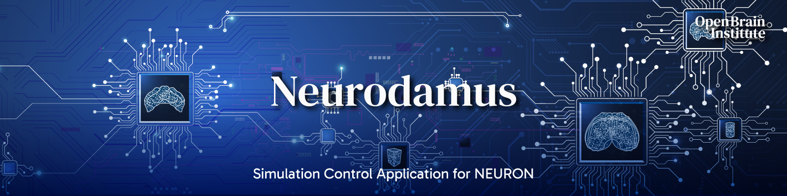

|banner|

=============
Neurodamus
=============
.. image:: https://zenodo.org/badge/640796304.svg
  :target: https://doi.org/10.5281/zenodo.8075201

Neurodamus is a BBP Simulation Control application for Neuron.

The Python implementation offers a comprehensive Python API for fine tuning of the simulation, initially defined by a BlueConfig file.

Description
===========

Neurodamus is the BBP in-house developed application for setting up large-scale neuronal simulations.
It has traditionally been implemented as a set of extensions to Neuron, in the form of .hoc and .mod files.
The parameters of the simulation are loaded from a configuration file, by default BlueConfig.

To address several limitations of the Hoc implementation, including development effort, the
high-level layers of Neurodamus have been reimplemented in Python.
Such implementation effectively makes available to the user a Python module with a comprehensive
API, suitable to fine control simulation aspects, as well as inspect and eventually adapt the
simulations as intended.

Install
=======

Prerequisites
-------------
- hdf5
- libsonatareport https://github.com/openbraininstitute/libsonatareport
- neuron with MPI https://github.com/neuronsimulator/nrn

Install neurodamus
------------------
.. code-block:: sh

  git clone https://github.com/openbraininstitute/neurodamus.git
  cd neurodamus
  pip install .

Build special with mod files
----------------------------
Once neuron and neurodamus are installed, you can build `special` with your mod files:

.. code-block:: sh

  mkdir mods
  cp -r <your-mod-files> mods/
  export DATADIR=$(python -c "import neurodamus; from pathlib import Path; print(Path(neurod)mus.__file__).parent / 'data')")
  cp -r $DATADIR/mod/* mods/
  nrnivmodl -incflags '-I <include-paths-of-our-dependencies>' -loadflags '-L <libs-paths-for-linking>' mods

To use the Blue Brain open models, you can build `neurodamus-models <https://github.com/openbraininstitute/neurodamus-models/>`_.
It will also produce a handy `build_neurodamus.sh` script that calls `nrnivmodl` with all dependencies to compile your future mod files

.. code-block:: sh

  build_neurodamus mods/

Examples
========
Once neurodamus is installed, you should be able to find the executable `neurodamus` in your path:

.. code-block::

  $ neurodamus
    Usage:
        neurodamus <ConfigFile> [options]
        neurodamus --help

Among the options you will find flags to tune run behavior.

Neurodamus explicitly depends on MPI libraries for parallel execution.
Therefore please use "srun" or "mpiexec" to launch it, according to your platform. If you
don't, complicated error messages may show up. Please remember it.

Even though a `neurodamus` launcher is provided, for production runs we suggest using
`special` instead. This way has proven to take advantage of optimized math libraries.
We hope to bring the same advantages to the launcher script soon.

.. code-block:: sh

 export NEURODAMUS_PYTHON=$(python -c "import neurodamus; from pathlib import Path; print(Path(neurod)mus.__file__).parent / 'data')")
 export HOC_LIBRARY_PATH=<hoc_files_folder>
 srun <srun params> <your_built_special> -mpi -python $NEURODAMUS_PYTHON/init.py <neurodamus params>

An example of a full installation with a simulation run can be found in the workflow test
`simulation_test.yml <https://github.com/openbraininstitute/neurodamus/blob/main/.github/workflows/simulation_test.yml>`__.

Docker container
================
Alternatively, you can start directly a neurodamus docker container where all the packages are built.
With the container, you can build your mod files and run simulations.

Building the docker container
-----------------------------

The docker images will be built in the `regular github action <https://github.com/openbraininstitute/neurodamus/actions>`_ - it is built on `tags`.

Docker container
----------------

With the docker image, you can start a neurodamus container with an interative Bash shell and meanwhile mount your local folder which contains your mod files and the circuit data.

.. code-block:: sh

  docker run --rm -it -v <full path of your folder_mods_circuit>:/mnt/mydata ghcr.io/openbraininstitute/neurodamus:$TAG /bin/bash

Within that, one can examine the `/opt/obi/env-neocortex.sh` file to see how neocortext models are set up.
NEURON is installed, so by activating the virtual environment with `source $USER_ENV/bin/activate` one gets access to `neuron` and `neurodamus`

Acknowledgment
==============
The development of this software was supported by funding to the Blue Brain Project,
a research center of the École polytechnique fédérale de Lausanne (EPFL),
from the Swiss government's ETH Board of the Swiss Federal Institutes of Technology.

Copyright (c) 2005-2024 Blue Brain Project/EPFL

Copyright (c) 2025-2026 Open Brain Institute

.. substitutions

