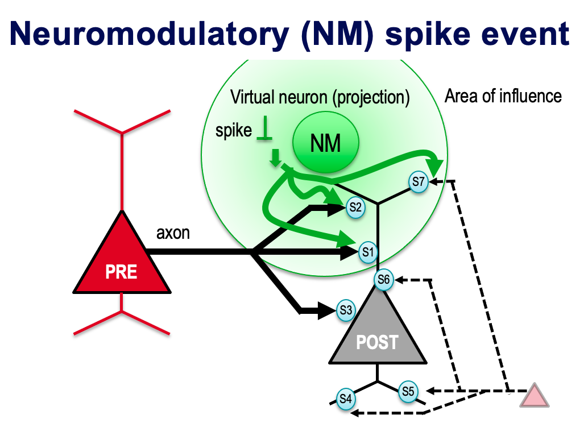

===============
Neuromodulation
===============

A neuromodulatory event influences synaptic behaviours by simulating additional neurontransmitters. It is implemented by linking from projection fibers to existing synapses as illustrated below:

Projection edges (connection type in SONATA: `neuromodulatory`) are created between virtual neurons and existing connectome synapses, as defined by `SONATA docs <https://sonata-extension.readthedocs.io/en/latest/https://sonata-extension.readthedocs.io/en/latest/sonata_tech.html#fields-for-neuromodulatory-connection-type-edges>`_.

- A neuromodulator sends a spike, and the relevent post cell receives the spike at synapses e.g. S1, S2 and S7.
- The synapse model at S1, S2, and S7 has to manage both presyanaptic spikes (nc_type = 0) and neuromodulatory spikes (nc_type = 10).
- Neuromodulatory spikes may change parameters in the synapse models (e.g. `Use`), but not the membrane current `i`.
- The neuromodulators influence one or more, but not all synapses from a PRE neuron (e.g. S3 is not changed)
- The neuromodulators influence synapses coming from different neurons (e.g. S7 that comes from somewhere else)

For each neuromodulatory projection, ``Neurodamus`` finds its closest post cell synapse by the location parameter, the exact `afferent_section_id` and the closest `afferent_section_pos` (< 0.05).

Spikes from neuromodulators are injected via `replay <https://sonata-extension.readthedocs.io/en/latest/sonata_simulation.html#synapse-replay-spikes>`_.

The neuromodulatory strength (`neuromodulation_strength`) and decay time (`neuromodulation_dtc`) are pre-defined in projection edges, and users can override them via a simulation config file, see `connection_overrides <https://sonata-extension.readthedocs.io/en/latest/sonata_simulation.html#connection-overrides>`_.

